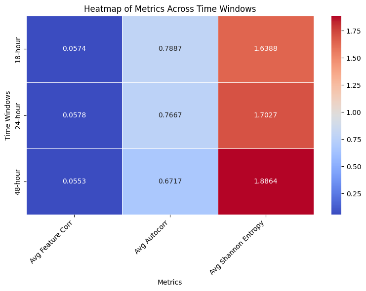

<p align="center">
    <h1 align="center">
        When Simpler Is Better: Traditional Models Outperform LLMs in ICU Mortality Prediction
    </h1>
     <p>This study compares traditional machine learning models to a multi-modal LLM-based model for predicting ICU mortality using the MIMIC-III dataset. We test several time windows (6, 12, 18, 24, and 48 hours) after admission. The results show that traditional models, especially Random Forest, consistently perform better and are more efficient than the LLM-based model. Our analysis finds that higher feature correlation, steady data patterns, and balanced variability lead to better predictions. While LLMs have potential, their current complexity and longer training times make them less practical without careful data selection and preparation. These findings highlight the importance of choosing both the right model and the right time windows to achieve reliable ICU mortality predictions.</p>
</p>

<p align="center">
  
</p>


# Dataset

Please check [document of dataset](./documents/dataset.md)


# Training

We utilize a customized development container (devcontainer) to conduct all experiments within an isolated environment. This approach ensures consistency across development setups and mitigates issues related to Python dependencies. 

Different models have different training strategies, please check below:

## Training Customized LLM

For training the customized LLM model. Please use `tmux`

```
tmux new -s session_name
tmux ls
tmux a -t session_name
time python experiments/measurement_notes/measurement_notes_llm.py > train_log.txt 2>&1
Control+B D

tail -f train_log.txt
```

## Training Traditional Models

For training the traditional ML model, please use [Makefile](./Makefile).


# Acknowledgements

I acknowlwdge:
* [Ryan King etc al.](https://github.com/kingrc15/multimodal-clinical-pretraining)'s work. 
* [YerevaNN](https://github.com/YerevaNN/mimic3-benchmarks)

Thanks for your contribution.
